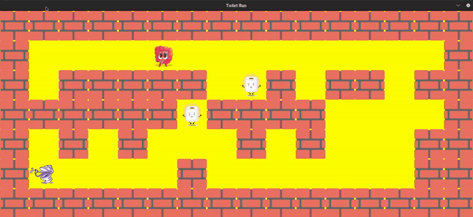

# <div align="center">So Long - 2D Game Project</div>

<div align="center">
  
</div>

## <div align="center">Table of Contents</div>
- [Introduction](#introduction)
- [Objectives](#objectives)
- [Game Mechanics](#game-mechanics)
- [Map Format](#map-format)
  - [Valid Map Requirements](#valid-map-requirements)
  - [Invalid Map Conditions](#invalid-map-conditions)
- [Controls](#controls)
- [Installation](#installation)
- [Usage](#usage)
- [Technical Details](#technical-details)
- [Error Handling](#error-handling)
- [Resources](#resources)
- [License](#license)

## <div align="center">Introduction</div>

**So Long** is a simple 2D game developed as part of the curriculum at 42 School. The project involves creating a game where the player controls a character that collects items on a map and exits after collecting all items. The game is developed using C and the MiniLibX graphical library.

## <div align="center">Objectives</div>

The main objectives of this project are:
- Enhancing proficiency in C programming.
- Managing windows and handling events such as keyboard and mouse inputs.
- Working with 2D graphics, textures, and simple algorithms.
- Understanding and implementing proper memory management.

## <div align="center">Game Mechanics</div>

In this game, you control a character on a 2D map. The player's objective is to collect all the collectibles (e.g., coins, fish, etc.) on the map and then reach the exit. The game is played in a grid-based environment where the player can move in four directions: up, down, left, and right.

### Key Features:
- **Collectibles:** Items that the player must collect before they can exit the map.
- **Walls:** Obstacles that the player cannot pass through.
- **Exit:** The goal point that the player must reach after collecting all items.
- **Movement Counter:** Displays the current number of movements in the terminal.

## <div align="center">Map Format</div>

The game map is represented as a `.ber` file, which is a text file containing a grid of characters. The map can include the following characters:

- `0` - Empty space
- `1` - Wall
- `C` - Collectible item
- `E` - Exit
- `P` - Player's starting position

### Example Map:
1111111
1P00001
100C001
1E00001
1111111

- The map must contain exactly one player (`P`), at least one exit (`E`), and at least one collectible (`C`).
- The map must be fully enclosed by walls (`1`).
- The map must be rectangular, meaning all rows must have the same length.

### Valid Map Requirements

For a map to be considered valid, it must satisfy the following conditions:

1. **Single Player Start:**
   - Exactly one `P` character must be present to denote the player's starting position.

2. **At Least One Exit:**
   - At least one `E` character must be present to provide an exit point.

3. **At Least One Collectible:**
   - At least one `C` character must be present for the player to collect.

4. **Rectangular Shape:**
   - All rows in the map must have the same number of characters, ensuring a rectangular layout.

5. **Surrounded by Walls:**
   - The outer boundary of the map must consist entirely of walls (`1`), preventing the player from moving outside the map.

6. **Valid Path:**
   - There must be a valid path that allows the player to collect all collectibles and reach an exit without encountering impassable obstacles.

### Invalid Map Conditions

A map is considered invalid if it fails to meet any of the following conditions:

1. **Multiple or No Player Start:**
   - **Error:** More than one `P` character or none at all.
   - **Message Example:** `"Error\nInvalid number of player start positions."`

2. **No Exit:**
   - **Error:** Missing `E` character(s).
   - **Message Example:** `"Error\nNo exit point found in the map."`

3. **No Collectibles:**
   - **Error:** Missing `C` character(s).
   - **Message Example:** `"Error\nNo collectibles found in the map."`

4. **Non-Rectangular Shape:**
   - **Error:** Rows of differing lengths.
   - **Message Example:** `"Error\nMap is not rectangular."`

5. **Map Not Surrounded by Walls:**
   - **Error:** Any border cell not being a wall (`1`).
   - **Message Example:** `"Error\nMap is not properly enclosed by walls."`

6. **Invalid Characters:**
   - **Error:** Presence of characters other than `0`, `1`, `C`, `E`, `P`.
   - **Message Example:** `"Error\nMap contains invalid characters."`

7. **No Valid Path:**
   - **Error:** No possible path to collect all collectibles and reach an exit.
   - **Message Example:** `"Error\nNo valid path to collect all items and reach the exit."`

8. **Duplicate Exits or Starts:**
   - **Error:** More than one exit (`E`) or duplicate starting positions.
   - **Message Example:** `"Error\nMultiple exits found in the map."`

9. **Empty or Missing Map File:**
   - **Error:** The map file is empty or does not exist.
   - **Message Example:** `"Error\nMap file is empty or cannot be opened."`

10. **Incorrect File Extension:**
    - **Error:** The map file does not have a `.ber` extension.
    - **Message Example:** `"Error\nMap file must have a .ber extension."`

## <div align="center">Controls</div>

The player can control the character using the following keys:
- `W` - Move Up
- `A` - Move Left
- `S` - Move Down
- `D` - Move Right

### Alternative Controls:
- You can also use `Z`, `Q`, `S`, `D` or the arrow keys for movement.

## <div align="center">Installation</div>

To set up the project, follow these steps:

1. **Clone the repository:**
   ```bash
   git clone https://github.com/your-username/so_long.git
   cd so_long
Compile the project: Run the Makefile to compile the project:

make
This will generate the executable so_long.

<div align="center">Usage</div>
To run the game, use the following command:

./so_long path/to/map.ber
Example:

./so_long maps/sample_map.ber
This command will open a window with the game based on the specified map file.

<div align="center">Technical Details</div>
MiniLibX: The game uses MiniLibX, a simple graphical library, to manage the window, handle events, and render the game.

Memory Management:

We made proper care to ensure all dynamically allocated memory is freed when no longer needed, preventing any memory leaks.
Each time the player moves or performs an action, the game reads the map again for control purposes instead of relying on a single read at the start. This practice ensures that the game always operates based on the current state of the map, providing more accurate and responsive gameplay.
Makefile: The project includes a Makefile that handles the compilation with the following targets:

make all: Compiles the project.
make clean: Removes object files.
make fclean: Removes object files and the executable.
make re: Recompiles the project from scratch.
make bonus: Compiles bonus features (if applicable).
<div align="center">Error Handling</div>
The game includes robust error handling for various scenarios:

Invalid Map:
If the map does not meet the required specifications (e.g., missing exit, multiple players, not enclosed by walls), the program will print an error message and exit.
Memory Allocation Failure:
If memory allocation fails, the program will print an error message and exit.
Invalid Input:
If the provided map file does not exist, cannot be opened, or has an incorrect extension, an error message will be displayed.
Invalid Characters:
If the map contains characters other than 0, 1, C, E, P, an error message will be displayed.
No Valid Path:
If there is no valid path to collect all collectibles and reach an exit, the program will notify the user and exit.
Segmentation Faults and Other Crashes:
The program ensures that it does not quit unexpectedly due to segmentation faults, bus errors, double frees, etc. Proper checks and validations are in place to handle such scenarios gracefully.
Example Error Messages:


Error
Invalid number of player start positions.

Error
Map is not properly enclosed by walls.

Error
No valid path to collect all items and reach the exit.
<div align="center">Resources</div>
MiniLibX Documentation: MiniLibX Getting Started
42 School C Projects: 42 Cursus Overview
libft Library: libft Repository
Additional References:
Understanding 2D Game Development
C Programming Language Resources
<div align="center">License</div>
This project is licensed under the MIT License. See the LICENSE file for details.
