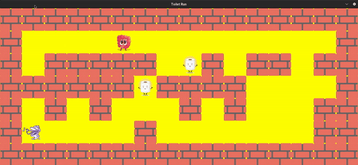

# so_long

A grid-based 2D game in C and MiniLibX: collect every item, then reach the exit. Built as part of the 42 curriculum.

<p align="center"></p>

## Play

The map is a `.ber` text file. `1` denotes a wall, `0` floor, `P` the player, `C` a collectible, and `E` the exit. The parser checks the shape, required entities, enclosing walls and reachability before the window opens.

```text
1111111
1P00001
100C001
1E00001
1111111
```

Move with W/A/S/D; the terminal prints a move count. Collect the item before stepping onto the exit.

## Build and run

Requires a C compiler, Make, MiniLibX dependencies and a graphical session.

```sh
make
./so_long maps/maps_valid/ok.ber
```

Additional valid and deliberately invalid cases are organized under [`maps/`](maps). `make clean`, `make fclean` and `make re` are available.

## Explore the code

- [`src/`](src) — map validation, game state, rendering and input
- [`include/`](include) — interfaces
- [`textures/`](textures) — game sprites

The preview above is a repository asset, so it remains tied to the actual game rather than an unrelated illustration.
